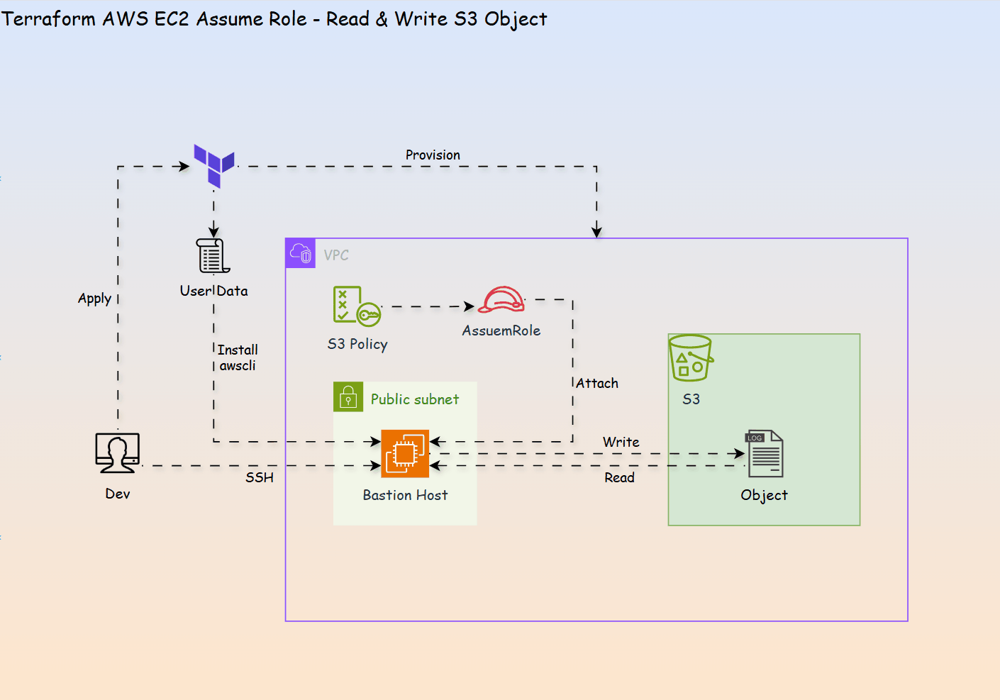
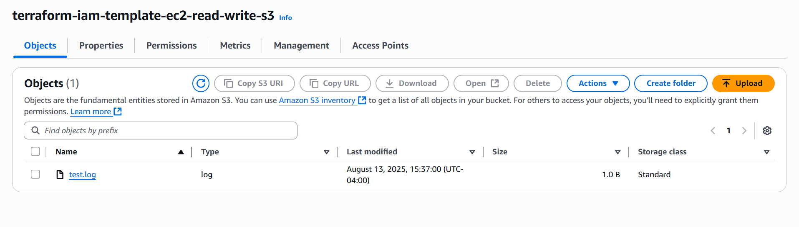
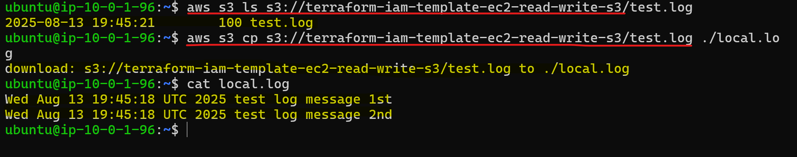

# Terraform AWS EC2 AssumeRole Template - Read & Write S3 Object

A Terraform template of EC2 AssumeRole to read and write object in S3.

- [Terraform AWS EC2 AssumeRole Template - Read \& Write S3 Object](#terraform-aws-ec2-assumerole-template---read--write-s3-object)
  - [Diagram](#diagram)
  - [Initialize](#initialize)
  - [Terraform Initialize](#terraform-initialize)
  - [User Data](#user-data)
  - [Read \& Write S3 Object via Bastion Host](#read--write-s3-object-via-bastion-host)

---

## Diagram



## Initialize

```sh
terraform init --backend-config="state.config"
```

---

## Terraform Initialize

```sh
# initialize with remote backend
terraform init -backend-config=state.config
```

---

## User Data

1. Install awscli.
2. Create local file.
3. Copy local file to s3 bucket.

```sh
#!/bin/bash

BUCKET_NAME="terraform-iam-template-ec2-read-write-s3"
OBJECT_FILE="test.log"

# update index
sudo apt update

# install unzip
sudo apt install unzip

# install awscli
curl "https://awscli.amazonaws.com/awscli-exe-linux-x86_64.zip" -o "awscliv2.zip"
unzip awscliv2.zip
sudo ./aws/install

# create a local file
echo >> /home/ubuntu/$OBJECT_FILE <<EOF
$(date) test log message 1st
$(date) test log message 2nd
EOF

# write to s3 bucket
aws s3 cp /home/ubuntu/$OBJECT_FILE s3://$BUCKET_NAME
```

- Confirm





---

## Read & Write S3 Object via Bastion Host

- Using AWS CLI

```sh
# List Objects in a Bucket
aws s3 ls s3://terraform-iam-template-ec2-read-write-s3
# 2025-08-13 19:23:27          1 test.log

# Upload a Folder (Recursive)
mkdir ./dir
touch ./dir/test01 ./dir/test02
aws s3 cp ./dir/ s3://terraform-iam-template-ec2-read-write-s3/dir --recursive
# upload: dir/test02 to s3://terraform-iam-template-ec2-read-write-s3/dir/test02
# upload: dir/test01 to s3://terraform-iam-template-ec2-read-write-s3/dir/test01

# confirm
aws s3 ls s3://terraform-iam-template-ec2-read-write-s3/dir/
# 2025-08-13 19:25:31          0 test01
# 2025-08-13 19:25:31          0 test02

# Upload a File
echo "$(date) this is a test from bastion host." > ./textfile
aws s3 cp ./textfile s3://terraform-iam-template-ec2-read-write-s3/textfile
# upload: ./textfile to s3://terraform-iam-template-ec2-read-write-s3/textfile

# Download a File
aws s3 cp s3://terraform-iam-template-ec2-read-write-s3/textfile ./textfile1
# download: s3://terraform-iam-template-ec2-read-write-s3/textfile to ./textfile1
cat ./textfile1
# Wed Aug 13 19:27:42 UTC 2025 this is a test from bastion host.

# Remove a File
aws s3 rm s3://terraform-iam-template-ec2-read-write-s3/textfile
# delete: s3://terraform-iam-template-ec2-read-write-s3/textfile

# Remove All Files in a Folder
aws s3 rm s3://terraform-iam-template-ec2-read-write-s3/dir/ --recursive
# delete: s3://terraform-iam-template-ec2-read-write-s3/dir/test02
# delete: s3://terraform-iam-template-ec2-read-write-s3/dir/test01

# Empty a bucket
aws s3 rm s3://terraform-iam-template-ec2-read-write-s3 --recursive
```
